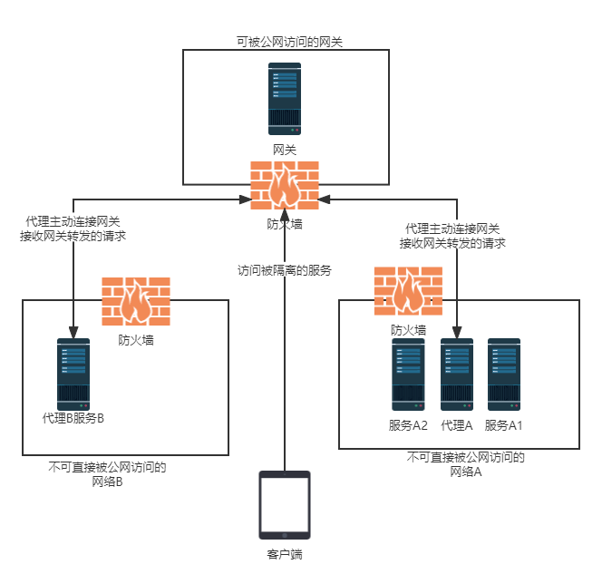

# leonet
A network manage tool ,can fast join different network

# 简介
快速连接不同的局域网

相对VPN具备以下优势:

1. 配置简单,图形化配置
2. 对网络资源进行细粒度的访问控制
3. 双向TLS认证

相对内网穿透具备以下优势:

1. 可以快速连接多个网络
2. 可以方便暴露多个不同的网络服务
3. 对网络资源进行权限管控
4. 支持DNS流量转发,采用了内部DNS的服务也可通过域名访问

# 应用场景
替代VPN、内网穿透,远程办公,打通不同云厂商的网络,访问不可达网络,游戏加速(需要二次开发)...

# 网络架构图

* "网关"可以与"代理"处在同一网络,只需要"网关"可被公网公开访问即可
* "代理"仅需要能够与"网关"建立HTTP2连接即可,无需在公网暴露
* "网关"和"代理"均可以使用负载均衡技术部署多个节点

# 工作原理
工作在第3层,支持TCP,UDP.

客户端拦截并分析本地流量,自动将需要转发的流量路由到"网关","网关"鉴权后将请求转发给"代理"节点,由"代理"节点完成资源请求,并将结果原路返回.

使用上图举例:客户端需要访问网络A中的服务A1.

前置过程:
1. "网关"进行了"用户","资源","权限","网络"等必要的配置
2. 客户端向"网关"建立HTTP2连接,并向"网关"发送自己的TLS证书,"网关"校验客户端证书成功后,客户端与"网关"保持HTTP2连接
3. "代理"向"网关"建立HTTP2连接,并向"网关"发送自己的TLS证书,"网关"校验代理提交的证书成功后,"代理"与"网关"保持HTTP2连接
### "服务A1"无需使用域名访问情况下
1. 客户端拦截TCP或UDP请求,将流量封装为leonet专用格式并将数据包转发给网关
2. "网关"解析数据包,并根据"网络配置",寻找A1服务对应的"代理"节点的连接
3. "网关"进行权限校验,如果权限检查通过,将数据包下发给"代理A"
4. "代理A"解析数据包,将有效请求数据发送到"服务A1"
5. "服务A1"完成请求处理,将结果数据返回给"代理A","代理A"将结果返回"网关","网关"再返回给客户端

### "服务A1"需要使用域名访问情况下
1. "网关"配置"网络A"的DNS服务器地址
2. 客户端使用本地默认DNS无法查到对应地址后,使用leonet专用格式封装DNS请求,并发送到"网关"
3. "网关"解析数据包,鉴权成功后,找出"网络A"的"代理"节点连接
4. "网关"将数据包下发到"代理A"
5. "代理A"解析数据包,并DNS请求发送到"网络A"的DNS服务器
6. "网络A"的DNS服务器返回查询结果IP,并原路返回到客户端
7. 客户端缓存DNS查询结果,并通过IP与"服务A1"完成后续请求,过程同"服务A1"无需使用域名访问情况

# 平台支持
"网关","代理" 使用Go开发,理论上支持常见平台

客户端支持Windows,Linux,MacOS,Android.

IOS暂不法支持

# 子项目列表

[leonet-gateway](https://github.com/myleolei/leonet-gateway)

leonet-agent

leonet-client

leonet-client-windows

leonet-client-android

# 开发计划
目前此项目处于规划中,此文档也做为设计文档描述主要原理.每个组件的设计文档位于各子项目中

项目将按顺序优先开发 gateway,agent,client

后续将支持windwos和android平台的GUI客户端
